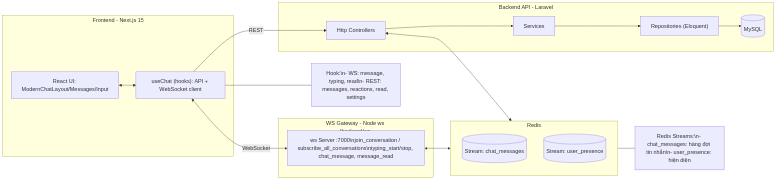
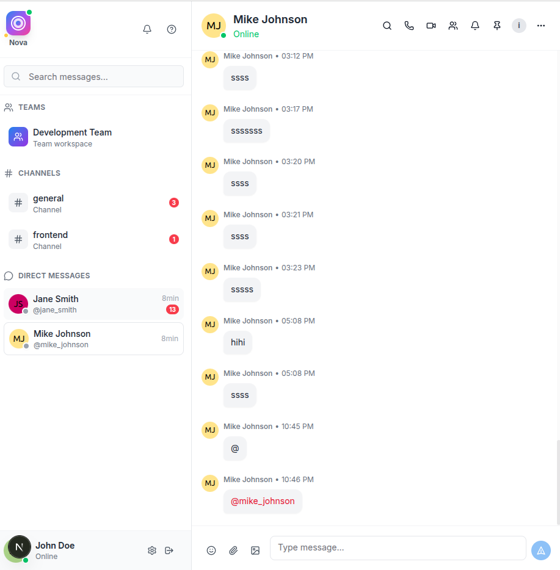

<p align="center">
  
</p>

### NovaChat — Laravel Open Source Chat (WebSocket + WebRTC)

Real-time chat built with Laravel 10 + Ratchet (pure PHP WebSocket), Redis, MySQL, and Next.js. Features typing indicators, read receipts, reactions, audio/video calls (WebRTC), and a modern UI.

Keywords: Laravel chat, Laravel WebSocket, Ratchet PHP, Redis pub/sub, WebRTC, open source chat, self-hosted chat.

## Features

- **Realtime messaging (WebSocket)**: Ratchet server in PHP, presence, typing, read receipts
- **Direct messages & group conversations**: Unread counters per user
- **Reactions & editing**: Emoji reactions, edit/delete with history
- **Attachments**: Drag & drop, paste-to-upload, preview
- **Audio/Video calls (WebRTC)**: 1:1 calls, screen sharing, minimized draggable video modal
- **Online status**: Presence via Redis + heartbeat
- **Modern UI**: Tailwind CSS, virtualized message list
- **Auth**: Laravel Passport (OAuth2) + JWT on frontend

## Architecture



```mermaid
flowchart LR
  subgraph Client
    A[Next.js Frontend\nhttp://localhost:3000]
  end

  subgraph Server (Docker)
    N[Nginx\n:8000] --> B[(Laravel API\nphp-fpm)]
    S[[Supervisor]] --> C
    C[Ratchet WS Server\nws://:7001]
    B -- SQL --> D[(MySQL 8\n:3306)]
    E[(Redis 7\n:6379)]
    B <-. Pub/Sub .-> E
    C <-. Pub/Sub .-> E
  end

  A -- REST --> N
  A -- WebSocket --> C
  A <-- Signaling (rtc_offer/answer/candidate) --> C

  subgraph WebRTC
    T[(STUN/TURN)]
  end
  A -. ICE/NAT traversal .- T
```

- **Backend (Laravel 10)**
  - REST API: Controllers → Services → Repositories (Eloquent)
  - WebSocket: `app/WebSocket/ChatServer.php` (Ratchet) + `RedisBridge.php`
  - Command: `websocket:serve` integrates ReactPHP loop + Redis pub/sub
  - Supervisor keeps the WS server alive in Docker
  - MySQL for data, Redis for presence/pubsub

- **Frontend (Next.js 15 + TS)**
  - WebSocket client at `src/lib/websocket.ts`
  - Hooks: `useChat`, `useAudioCall`, `useVideoCall`
  - UI: `ModernChatLayout`, `ModernChatMessagesNew`, `VideoCallOverlay`

## Services & Ports

- **nginx**: `http://localhost:8000` → Laravel
- **app (php-fpm + Ratchet)**: WebSocket `ws://localhost:7001`
- **db (MySQL 8)**: `localhost:3306`
- **redis (7.x)**: `localhost:6379`
- **phpmyadmin**: `http://localhost:8080`

## Quick Start

1) Clone
```bash
git clone <your-repo-url>
cd NovaChat
```

2) Start backend (Docker)
```bash
cd backend
docker compose up -d --build
```

3) Initialize backend
```bash
# copy env then adjust DB/REDIS as needed
cp .env.example .env
docker compose exec app php artisan key:generate
docker compose exec app php artisan migrate --seed

# ensure WebSocket is running (Supervisor manages it)
docker compose exec app supervisorctl status ws-server | cat
```

4) Start frontend
```bash
cd ../frontend
npm install
echo "NEXT_PUBLIC_API_URL=http://localhost:8000/api" > .env.local
echo "NEXT_PUBLIC_WS_URL=ws://localhost:7001" >> .env.local
npm run dev
```

Open `http://localhost:3000`.

## WebSocket (Ratchet) in Laravel

- Command: `php artisan websocket:serve --port=7001`
- Implementation: `app/WebSocket/ChatServer.php`
- Redis bridge: `app/WebSocket/RedisBridge.php` subscribes and relays messages
- Managed by Supervisor: see `backend/supervisor/laravel-worker.conf` (`program:ws-server`)

Client messages (examples):
```json
{ "type": "join_conversation", "conversation_id": 19 }
{ "type": "chat_message", "conversation_id": 19, "content": "Hello" }
{ "type": "typing_start", "conversation_id": 19, "user_id": 1 }
{ "type": "message_read", "conversation_id": 19, "message_id": 6, "user_id": 1 }
{ "type": "rtc_offer", "conversation_id": 19, "sdp": "..." }
```

## WebRTC Calls

- Hooks: `src/hooks/useAudioCall.ts`, `src/hooks/useVideoCall.ts`
- Signaling: over WebSocket (`rtc_offer`, `rtc_answer`, `rtc_candidate`, `rtc_end`)
- STUN example: `stun:global.stun.twilio.com:3478`
- Screen share: `getDisplayMedia` in `useVideoCall`

## Environment

- Backend (`backend/.env`): DB_HOST, DB_DATABASE, DB_USERNAME, DB_PASSWORD, REDIS_HOST, APP_URL
- Frontend (`frontend/.env.local`):
  - `NEXT_PUBLIC_API_URL=http://localhost:8000/api`
  - `NEXT_PUBLIC_WS_URL=ws://localhost:7001`

## Common Commands

Backend (inside `backend/`):
```bash
docker compose exec app php artisan migrate
docker compose exec app php artisan db:seed
docker compose exec app php artisan cache:clear
docker compose logs -f app | cat
docker compose exec app supervisorctl restart ws-server
```

Frontend (inside `frontend/`):
```bash
npm run dev
npm run build
npm run lint
```

## Troubleshooting

- Port in use (7001): Only one WS server should run. Use Supervisor or `supervisorctl restart ws-server`.
- Composer PHP version mismatch: run composer inside Docker `app` service.
- Redis client errors: ensure Redis is up and `REDIS_HOST=redis` in backend `.env`.
- WebRTC device not found: app falls back to audio-only; check browser permissions.
- STUN URL invalid: use `stun:global.stun.twilio.com:3478` (no query params).
- Unread count wrong: logic uses `message_reads` table per-user; verify migrations and seeders.

## Contributing

PRs welcome! Please open issues for bugs/ideas. See code style and commit conventions used across the repo.

## License

MIT

— Built with Laravel, Ratchet, Redis, MySQL, Next.js.

## Screenshots


